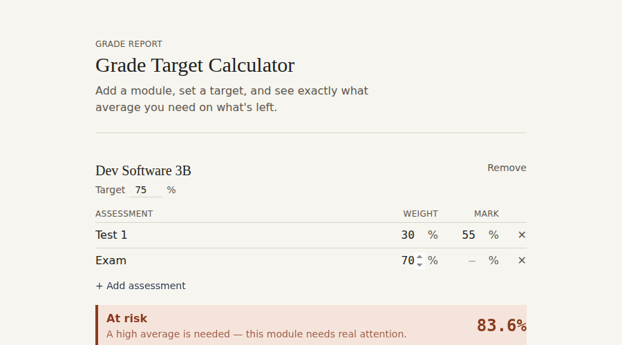

# Grade Target Calculator

A web app that solves a problem every student has faced: "what mark do I
actually need on my remaining assessments to hit my target grade?" Add your
modules and assessments, set a target, and see the exact average required
on what's left — colour-coded by how realistic it is.



## Why I built this

As a student, it's easy to lose track of whether you're actually on
target for a module until results come out — by which point it's too
late to do anything about it. I wanted something that does the algebra
for me the moment I enter a mark, and flags modules that need real
attention before the final exam is the only thing left.

## How the calculation works

If your final mark is `sum(weight × mark) / 100` across all assessments,
then once you know some of those marks, you can rearrange that formula to
solve for what you need on the rest:

```
pointsStillNeeded = targetGrade - currentWeightedMark
requiredAverageOnRemaining = (pointsStillNeeded / remainingWeight) × 100
```

The result gets a status:
- **Already safe** — you've hit the target even with 0% on what's left
- **On track** — a comfortable, realistic average needed
- **Tight** — doable, but needs focus
- **At risk** — a high average is needed
- **Not achievable** — even 100% on everything left wouldn't be enough

## What's tested

The calculation logic (`src/lib/gradeCalculator.ts`) is fully unit tested
with `src/lib/gradeCalculator.test.ts`, covering a typical case, an
"already safe" case, a mathematically impossible case, modules with
nothing left to write, and the status threshold boundaries. Run:

```bash
npx tsc --target ES2020 --module commonjs --esModuleInterop --skipLibCheck \
  --outDir /tmp/calc-test src/lib/gradeCalculator.ts src/lib/gradeCalculator.test.ts \
  && node /tmp/calc-test/gradeCalculator.test.js
```

The full app has also been built (`npm run build`) and manually verified
end-to-end with real browser interaction, including confirming that data
correctly persists across a page reload.

## Getting started

**Requirements:** Node.js 18+

```bash
git clone <your-repo-url>
cd grade-target-calculator
npm install
npm run dev
```

Then open [http://localhost:3000](http://localhost:3000). Your modules
are saved in the browser (localStorage), so they're still there next time
you open the app.

## Tech stack

Next.js (App Router) · TypeScript · Tailwind CSS · React

## Possible next steps

- Export/import your modules as a JSON file (or sync via a backend +
  database, like the HCCRM project)
- A "what-if" slider to see how a single upcoming test result changes
  every other module's risk level
- Support weighted sub-categories (e.g. "labs" worth 10% made up of 5
  smaller labs)
